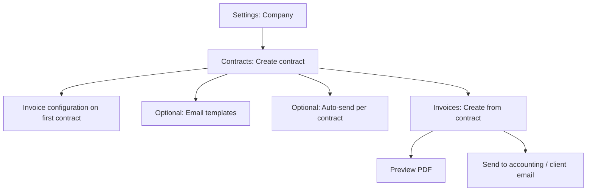
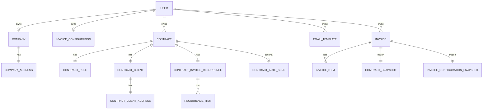

# Invoiced — Product Requirements Document

**Version:** 1.0  
**Last updated:** May 16, 2026  
**Status:** Living document (derived from current codebase)

---

## 1. Executive summary

**Invoiced** is a web application for **Brazilian PJ professionals** (freelancers and independent contractors) who need to organize contract-based billing, generate invoice PDFs, and email them to clients or accounting contacts—without juggling spreadsheets and ad hoc file naming.

The product centers on a simple loop: **configure your company once → register contracts with clients and billing schedules → create invoices (often from recurrence rules) → preview PDFs → send by email** using customizable templates.

**Tagline:** *Manage your invoices with ease* (`Manage your invoices with ease` / *Gestão de notas fiscais para profissionais PJ*)

---

## 2. Problem statement

PJ professionals in Brazil often:

- Bill multiple clients on different monthly schedules (e.g., 50% on day 5, 50% on day 20).
- Reuse the same legal/company data on every document but store it in inconsistent places.
- Manually name PDF files and track invoice numbers across tools.
- Send invoices by email with copy-pasted messages and no standard templates.
- Lack a single place to see issued invoices, tied to the contract and client that produced them.

Invoiced reduces this operational overhead by binding **company profile**, **contracts**, **recurrence rules**, **invoice artifacts**, and **email delivery** into one authenticated workspace.

---

## 3. Goals and success metrics

### 3.1 Product goals

| Goal | Description |
|------|-------------|
| **G1 — Fast setup** | A new user can sign in, create a company, and add a first contract in under 5 minutes (aligned with landing page promise). |
| **G2 — Repeatable billing** | Contracts encode role, rate, client, and split recurrence so invoices can be created predictably. |
| **G3 — Traceable invoices** | Each invoice immutably snapshots contract, client, address, and numbering config at issue time. |
| **G4 — Professional delivery** | PDF generation and templated email (Resend) with attachments. |
| **G5 — Localization** | Primary UX in Brazilian Portuguese with English support. |

### 3.2 Success metrics (target)

| Metric | Target / note |
|--------|----------------|
| Time to first invoice | &lt; 10 minutes from sign-up |
| Contract → invoice creation | &lt; 2 minutes for recurrence-based flow |
| Email send success rate | &gt; 99% when Resend is configured |
| Onboarding completion | % users completing company + contract + first send |
| Retention | Monthly active users with ≥1 invoice issued |

*Baseline measurement depends on analytics not yet wired in the dashboard.*

---

## 4. Target users and personas

### 4.1 Primary persona — **PJ contractor**

- Works as Pessoa Jurídica for one or more clients.
- Issues recurring monthly invoices (full or split).
- Needs PDFs for client finance teams and “contabilidade.”
- Comfortable with Google sign-in; expects Portuguese UI.

### 4.2 Secondary persona — **Small agency operator** (future)

- Multiple contracts; may need multi-company (Business plan on landing).
- Higher volume; exportable reports (planned).

### 4.3 Out of scope (v1)

- Full NFS-e / government tax invoice issuance (product generates **billing documents/PDFs**, not official Brazilian electronic service invoices unless integrated later).
- Payroll, expense tracking, and full ERP (cashflow area is reserved).

---

## 5. Product principles

1. **Company-first** — No contracts or invoices without a company profile (enforced server-side).
2. **Contract as source of truth** — Client, rate, recurrence, and auto-send settings live on the contract.
3. **Immutable invoice history** — Snapshots preserve what was true when the invoice was created.
4. **Progressive setup** — Onboarding checklist guides company → contract → send → email templates.
5. **Honest automation** — Email templates and per-contract auto-send config exist today; fully unattended scheduling is a roadmap item (see §10).

---

## 6. User journeys

### 6.1 Acquisition and sign-up

```mermaid
flowchart LR
  A[Landing page] --> B[Google OAuth]
  B --> C{Session?}
  C -->|Yes| D[/app]
  C -->|No| A
```

1. Visitor sees marketing site (hero, features, how-it-works, pricing, stats).
2. CTA triggers **Google OAuth** (Better Auth).
3. Authenticated users redirect to `/app` (dashboard).

### 6.2 Core billing loop



### 6.3 Contract creation (multi-step form)

1. **Role** — Description and monthly rate (integer).
2. **Client** — Company name, responsible name/email, full address (country-aware).
3. **Invoice recurrence** — One or more `{ dayOfMonth, percentage }` rows; total must equal **100%**; no duplicate days.
4. **Auto-send** — Toggle + email template (requires ≥1 template in Settings → Automations).
5. **First contract only** — Invoice file naming and numbering setup dialog.
6. **Summary** — Review before submit; optional PDF preview from form values.

### 6.4 Invoice creation

| Mode | Behavior |
|------|----------|
| **From recurrence** | User picks a recurrence item; system adds line item from contract role × percentage; issue date derived from recurrence day. |
| **Custom** | User sets issue date and one or more line items (description + amount); validation requires ≥1 item. |

On save, the system:

- Assigns filename from global invoice configuration + client name + date parts.
- Inserts invoice + line items.
- Snapshots contract, client, address, and invoice configuration linked to the invoice.

### 6.5 Send invoice email (“Enviar para contabilidade”)

1. User opens invoice list; for invoices whose **original contract** has auto-send + template configured, **Send to accounting** is shown.
2. Server builds PDF, renders template variables, sends via **Resend** to contract client `responsibleEmail` with PDF attachment.
3. Requires: company profile, valid recipient email, `RESEND_API_KEY`, and configured template.

**Note:** Sending is **user-triggered** in the current implementation, not cron-based.

---

## 7. Functional requirements

### 7.1 Authentication and account

| ID | Requirement | Priority | Status |
|----|-------------|----------|--------|
| AUTH-1 | Sign in with Google OAuth | P0 | Implemented |
| AUTH-2 | Session persistence (Better Auth + cookies) | P0 | Implemented |
| AUTH-3 | Protected `/app/*` routes for authenticated users only | P0 | Implemented |
| AUTH-4 | Update display name on account | P1 | Implemented |
| AUTH-5 | Delete account (permanent, cascades data) | P1 | Implemented |
| AUTH-6 | Email managed by Google (read-only in UI) | P1 | Implemented |

### 7.2 Company profile

| ID | Requirement | Priority | Status |
|----|-------------|----------|--------|
| CO-1 | One company per user (name, email) | P0 | Implemented |
| CO-2 | Company address (street, number, city, state, postal code, country) | P0 | Implemented |
| CO-3 | Block contract create/update without company | P0 | Implemented |
| CO-4 | Company zero-state with CTA to create | P0 | Implemented |

### 7.3 Contracts

| ID | Requirement | Priority | Status |
|----|-------------|----------|--------|
| CT-1 | CRUD contracts (list, create, edit, delete) | P0 | Implemented |
| CT-2 | Contract role: description + rate | P0 | Implemented |
| CT-3 | Contract client: company, responsible, email, address | P0 | Implemented |
| CT-4 | Recurrence items: day of month + percentage; sum = 100% | P0 | Implemented |
| CT-5 | Per-contract auto-send flag + email template reference | P0 | Implemented |
| CT-6 | Card list UI with selector + detail panel | P1 | Implemented |
| CT-7 | Invoice PDF preview from contract form | P1 | Implemented |
| CT-8 | Balance recurrence percentages tool in form | P2 | Implemented |

### 7.4 Invoice configuration (global per user)

| ID | Requirement | Priority | Status |
|----|-------------|----------|--------|
| IC-1 | Prefix (required for filename generation) | P0 | Implemented |
| IC-2 | Optional suffix | P1 | Implemented |
| IC-3 | Toggle year / month / day / client company name in filename | P1 | Implemented |
| IC-4 | Sequential `lastInvoiceNumber` (padded in filename) | P0 | Implemented |
| IC-5 | Setup wizard on first contract; edit in Settings → Invoice | P0 | Implemented |
| IC-6 | Live filename preview in settings | P1 | Implemented |

**Filename pattern (conceptual):**  
`{prefix}-{number}[-{company}][-{dd}][-{mm}][-{yyyy}][-{suffix}]`  
(unsafe characters sanitized)

### 7.5 Invoices

| ID | Requirement | Priority | Status |
|----|-------------|----------|--------|
| IN-1 | Create invoice from contract (recurrence or custom) | P0 | Implemented |
| IN-2 | Soft-delete invoice (`isDeleted`) | P1 | Implemented |
| IN-3 | List invoices with financial summary, client, items | P0 | Implemented |
| IN-4 | View invoice PDF in-app (PDF canvas viewer) | P0 | Implemented |
| IN-5 | Snapshot contract/client/config on create | P0 | Implemented |
| IN-6 | Send PDF email to client responsible (Resend) | P0 | Implemented (manual trigger) |
| IN-7 | Require invoice configuration before create | P0 | Implemented |

### 7.6 Email templates and automations

| ID | Requirement | Priority | Status |
|----|-------------|----------|--------|
| EM-1 | CRUD email templates (name, slug, subject, rich HTML body) | P0 | Implemented |
| EM-2 | Duplicate template | P1 | Implemented |
| EM-3 | Template variables: `{{client_name}}`, `{{issued_date}}` | P0 | Implemented |
| EM-4 | Block delete if template used by contract auto-send | P0 | Implemented |
| EM-5 | DOMPurify/safe HTML handling for body | P1 | Implemented |

### 7.7 Settings

| Tab | Requirements | Status |
|-----|--------------|--------|
| **Account** | Name edit, danger zone delete | Implemented |
| **Company** | Profile view, create/edit drawer | Implemented |
| **Invoice** | View/edit numbering and filename rules | Implemented |
| **Automations** | Email template list and upsert drawer | Implemented |
| **Notifications** | Manage notifications | Placeholder UI only |
| **Billing & plans** | Plan, payment method, billing history | Mock/static UI only |

### 7.8 Onboarding

| ID | Requirement | Priority | Status |
|----|-------------|----------|--------|
| OB-1 | Checklist: company, contract, send invoice (manual mark), email templates | P1 | Implemented |
| OB-2 | Dismiss / restore panel; persisted in local storage | P2 | Implemented |
| OB-3 | Deep links to relevant settings/routes | P1 | Implemented |

### 7.9 Internationalization

| ID | Requirement | Priority | Status |
|----|-------------|----------|--------|
| I18N-1 | Brazilian Portuguese (default) | P0 | Implemented |
| I18N-2 | English | P1 | Implemented |
| I18N-3 | Zod validation messages localized | P1 | Implemented |
| I18N-4 | Translation coverage check in CI (`check:translations`) | P2 | Implemented |

### 7.10 Marketing site

| ID | Requirement | Priority | Status |
|----|-------------|----------|--------|
| MKT-1 | Landing: hero, features, stats, how-it-works, pricing, CTA, footer | P1 | Implemented |
| MKT-2 | Pricing tiers: Starter (R$0), Pro (R$39), Business (R$79) | P2 | Marketing only |
| MKT-3 | Google sign-in from pricing CTAs | P1 | Implemented |

---

## 8. Non-functional requirements

### 8.1 Security and privacy

- All app data scoped by `userId`; server functions use session middleware.
- OAuth via Better Auth; secrets via environment variables.
- Account deletion removes user-associated data (Better Auth `deleteUser` enabled).
- Email content from user-authored templates; outbound via Resend with idempotency keys per send.
- Inbound email processing is **not** in scope.

### 8.2 Performance and reliability

- SQLite via **Turso** (`@libsql/client`) for edge-friendly persistence.
- PDF generation server-side (`@react-pdf/renderer`).
- Target landing stats (marketing): 99.9% uptime — operational SLO TBD.

### 8.3 Accessibility

- Shared a11y translation keys for tables, sidebar, form controls.
- Component library patterns (Radix / Base UI) for dialogs, menus, tabs.

### 8.4 Observability

- Vercel Analytics and Speed Insights included in dependencies.
- Product analytics for funnel metrics not yet specified in app code.

### 8.5 Environment configuration

| Variable | Purpose |
|----------|---------|
| `TURSO_DATABASE_URL` / `TURSO_AUTH_TOKEN` | Database |
| `BETTER_AUTH_URL` / `BETTER_AUTH_SECRET` | Auth |
| `GOOGLE_CLIENT_ID` / `GOOGLE_CLIENT_SECRET` | Google OAuth |
| `RESEND_API_KEY` | Email sending (optional in dev) |
| `RESEND_FROM` | Sender address (defaults to Resend sandbox) |

---

## 9. Information architecture

### 9.1 Routes (authenticated)

| Path | Purpose |
|------|---------|
| `/app` | Redirect / home |
| `/app/dashboard` | Welcome (minimal today) |
| `/app/contracts` | Contract management |
| `/app/invoices` | Invoice list, view, create, delete, send |
| `/app/cashflow` | Placeholder |
| `/app/settings` | Tabbed settings (`?tab=`) |

### 9.2 Data model (conceptual)



**Snapshot tables** (`contractSnapshot`, `contractClientSnapshot`, `contractClientAddressSnapshot`, `invoiceConfigurationSnapshot`) preserve historical accuracy when contracts or settings change later.

---

## 10. Roadmap and known gaps

Features advertised or stubbed in the repo but **not fully productized**:

| Item | Current state | Target |
|------|---------------|--------|
| **Scheduled auto-send** | Config + manual “Send to accounting” | Cron/worker sends on recurrence dates (Pro) |
| **Dashboard** | Welcome message only | KPIs: upcoming recurrences, recent invoices, onboarding |
| **Cashflow** | Title placeholder | Revenue view tied to issued invoices |
| **Notifications settings** | Copy only | User preferences for reminders |
| **Subscription billing** | Static mock in Settings | Stripe (or similar) + plan enforcement |
| **Plan limits** | Landing copy (e.g. 3 contracts on Starter) | Server-side enforcement |
| **Multi-company** | Business plan marketing | Multiple company entities per account |
| **Exportable reports** | Business plan marketing | CSV/PDF exports |
| **Filters on invoice history** | Landing feature copy | Period, client, status filters |
| **Official NFS-e** | Not present | Optional future integration |

---

## 11. Pricing and packaging (marketing intent)

Aligned with `LandingPricingSection` — **not enforced in application logic today**.

| Plan | Price | Positioning | Advertised limits |
|------|-------|-------------|-------------------|
| **Starter** | R$ 0 / month | Organize PJ billing | Up to 3 active contracts; manual invoices; basic email reminders |
| **Pro** | R$ 39 / month | Recurring PJ routine | Unlimited contracts; automatic invoice sending; dashboard history & filters; priority support |
| **Business** | R$ 79 / month | Higher volume | Multi-company; advanced automation rules; exportable reports; dedicated support |

---

## 12. Out of scope (explicit)

- Payment collection from end clients (Invoiced bills **the PJ user** for SaaS, not client payments).
- Inventory, tax filing, bank reconciliation.
- Mobile native apps (responsive web only).
- Team/multi-user workspaces per company (single user per account today).

---

## 13. Acceptance criteria (MVP — current release)

The MVP is considered complete when a user can:

1. Sign in with Google.
2. Create company profile with address.
3. Create email template(s) in Automations.
4. Create a contract with recurrence totaling 100% and optional auto-send template.
5. Complete invoice configuration (first contract flow).
6. Create an invoice (recurrence or custom) and view PDF.
7. Send invoice PDF by email to the contract responsible when auto-send is configured and Resend is set up.
8. Delete invoices and contracts with appropriate confirmations.
9. Switch UI language (PT / EN).
10. Complete or dismiss onboarding checklist.

---

## 14. Open questions

1. **Legal document type** — Should PDFs be labeled “Recibo” / “Nota de débito” / neutral “Fatura” for Brazilian compliance expectations?
2. **Currency** — Amounts stored as integers; confirm BRL-only formatting for launch.
3. **Number increment** — Should `lastInvoiceNumber` auto-increment on each invoice create (currently used in filename/PDF display; verify increment behavior in API).
4. **Auto-send naming** — Rename “Send to accounting” if primary recipient is the client, not accountant?
5. **Subscription provider** — Stripe vs Paddle vs Mercado Pago for BR market.

---

## 15. Appendix

### 15.1 Tech stack reference

- **Frontend:** React 19, TanStack Router/Start/Query/Form/Table, Tailwind CSS 4, Framer Motion
- **Auth:** Better Auth (Google)
- **DB:** Drizzle ORM + SQLite (Turso)
- **Email:** Resend
- **PDF:** `@react-pdf/renderer`, `@react-pdf-viewer/core`
- **Runtime:** Bun, Vite, Nitro

### 15.2 Glossary

| Term | Meaning |
|------|---------|
| **PJ** | Pessoa Jurídica — legal entity for independent professionals in Brazil |
| **Contract** | Billing relationship: your role, client, schedule, optional auto-send |
| **Recurrence item** | Billing slice: day of month + % of monthly rate |
| **Invoice configuration** | Global rules for PDF filename and numbering |
| **Snapshot** | Frozen copy of entities at invoice creation time |
| **Auto-send** | Contract-level link to an email template used when sending invoice PDFs |

### 15.3 Related documents

- `AGENTS.md` — Agent skill routing for contributors
- Translations: `src/translations/br-translations.ts`, `src/translations/en-translations.ts`
- App config: `src/utils/appConfig.ts`

---

*This PRD reflects the repository as of May 2026. Update when roadmap items ship or positioning changes.*
